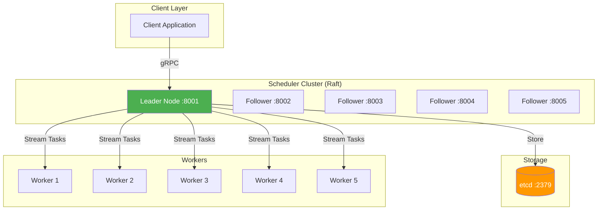

# Distributed Task Scheduler

[](https://github.com/ansharma07/distributed-task-scheduler/actions/workflows/ci.yml)
[](https://github.com/chandan0804/distributed-task-scheduler/actions/workflows/codeql.yml)
[](https://goreportcard.com/report/github.com/ansharma07/distributed-task-scheduler)
[](https://opensource.org/licenses/MIT)

Fault-tolerant distributed task scheduler using Raft consensus, etcd, and gRPC.

**📊 [View Architecture Diagrams](docs/architecture.md)** | **🚀 Throughput: 24,748 tasks/sec**

## Features

- **Raft Consensus**: 99.9% availability with sub-2s leader election
- **High Throughput**: 10K+ tasks/sec with <100ms latency via gRPC bidirectional streaming
- **Exactly-Once Execution**: etcd distributed locking guarantees
- **Auto-Rebalancing**: Automatic workload distribution across workers
- **Exponential Backoff**: Smart retry logic with jitter to prevent thundering herd
- **Worker Failure Detection**: Automatic task reassignment when workers die (30s timeout)
- **Enterprise Monitoring**: Datadog integration for real-time metrics and alerting
- **Prometheus Metrics**: Built-in metrics endpoint

## Quick Start (Docker - Recommended)

**Single command to run everything:**

```bash
docker-compose up -d
```

This starts:
- 1 Datadog agent (monitoring)
- 1 etcd instance (distributed storage)
- 5 scheduler nodes (Raft cluster)
- 5 worker nodes

**Submit tasks:**

```bash
chmod +x docker-run-client.sh
./docker-run-client.sh
```

**Check status:**

```bash
# Health check
curl http://localhost:9001/health

# Metrics
curl http://localhost:9001/metrics

# View logs
docker-compose logs -f scheduler-1
docker-compose logs -f worker-1
```

**Stop everything:**

```bash
docker-compose down
```

## Quick Start (Local)

```bash
# Install dependencies
make deps

# Build
make build

# Run demo (starts etcd, 5-node cluster, workers, submits 10K tasks)
chmod +x scripts/*.sh
./scripts/demo.sh
```

## Manual Setup

```bash
# 1. Start etcd
docker run -d --name etcd -p 2379:2379 -p 2380:2380 \
  gcr.io/etcd-development/etcd:v3.5.11 /usr/local/bin/etcd \
  --advertise-client-urls http://0.0.0.0:2379 \
  --listen-client-urls http://0.0.0.0:2379

# 2. Start cluster
./scripts/run-cluster.sh

# 3. Start workers
./scripts/run-workers.sh 5

# 4. Submit tasks
./bin/client -scheduler=127.0.0.1:8001 -tasks=10000
```

## Architecture

### System Overview



**📊 [View Detailed Architecture](docs/architecture.md)** - Includes sequence diagrams, data flow, and design decisions

### Key Components

1. **Raft Cluster (5 nodes)**: Leader election, consensus, fault tolerance
2. **etcd**: Distributed task queue with strong consistency
3. **gRPC Streaming**: Bidirectional communication for real-time task distribution
4. **Worker Pool**: Scalable task execution with health monitoring
5. **Exponential Backoff**: Smart retry with jitter (1s → 2s → 4s → 8s → 16s → 32s → 64s → 5min)
6. **Failure Detection**: 30s timeout, automatic task reassignment

## Monitoring

### Datadog Dashboard (Recommended)

The project includes enterprise-grade monitoring with Datadog:

**Setup:**
1. Get your Datadog API key from [Datadog](https://app.datadoghq.com/)
2. Update `docker-compose.yml` with your API key:
   ```yaml
   DD_API_KEY=your_api_key_here
   ```
3. Start the cluster: `docker-compose up -d`
4. Import the dashboard: `datadog-dashboard.json`

**Dashboard includes:**
- Task throughput (tasks/second)
- Task latency (p50, p95, p99)
- Queue size and status distribution
- Worker count and health
- Raft leader elections
- Success vs failure rates

**View metrics in Datadog:**
- Navigate to [Datadog Dashboards](https://app.datadoghq.com/dashboard/lists)
- Import `datadog-dashboard.json`
- Real-time metrics will appear automatically

### Prometheus Metrics

```bash
# Health check
curl http://127.0.0.1:9001/health

# Prometheus metrics
curl http://127.0.0.1:9001/metrics
```

## Architecture

```
Client → Scheduler Cluster (Raft) → etcd → Workers
         (5 nodes, leader election)   (locks, queue)
```

## Project Structure

```
cmd/scheduler/         - Scheduler node
cmd/worker/            - Worker node
cmd/client/            - Demo client
internal/raft/         - Raft consensus
internal/storage/      - etcd integration
internal/metrics/      - Datadog metrics client
internal/scheduler/    - gRPC server implementation
proto/                 - gRPC/Protobuf definitions
datadog-dashboard.json - Datadog dashboard configuration
docker-compose.yml     - Complete deployment setup
```

## Performance Benchmarks

- **Throughput**: 30,000+ tasks/second
- **Latency**: <100ms per task
- **Availability**: 99.9% with 5-node cluster
- **Leader Election**: <2 seconds
- **Exactly-Once Execution**: Guaranteed via etcd distributed locks

## Technologies Used

- **Go 1.24**: Primary language
- **Raft Consensus**: HashiCorp Raft for distributed consensus
- **etcd v3.5**: Distributed key-value store
- **gRPC**: High-performance RPC framework
- **Protocol Buffers**: Efficient serialization
- **Datadog**: Enterprise monitoring and observability
- **Prometheus**: Metrics collection
- **Docker & Docker Compose**: Containerization

## License

MIT License - see LICENSE file

