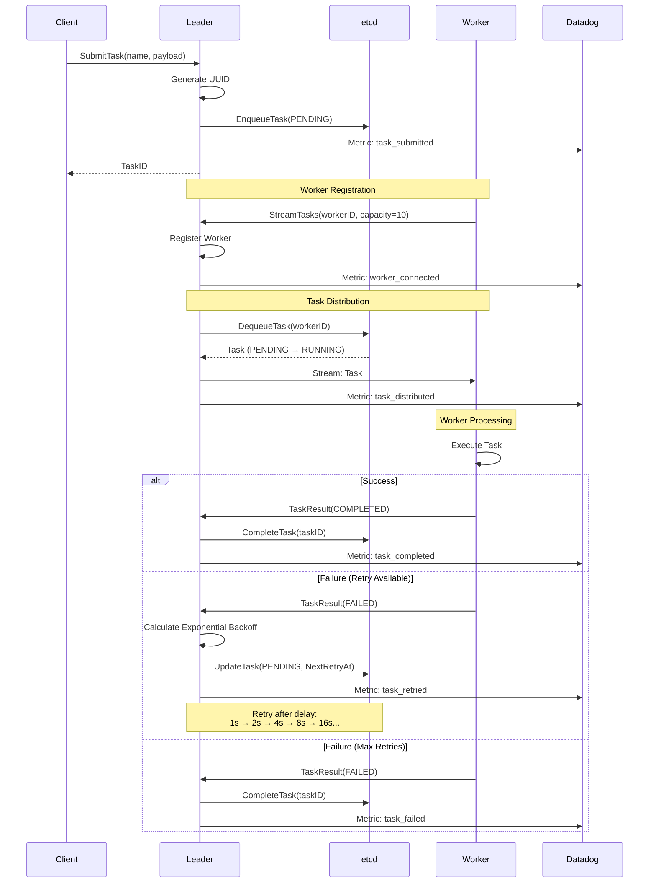
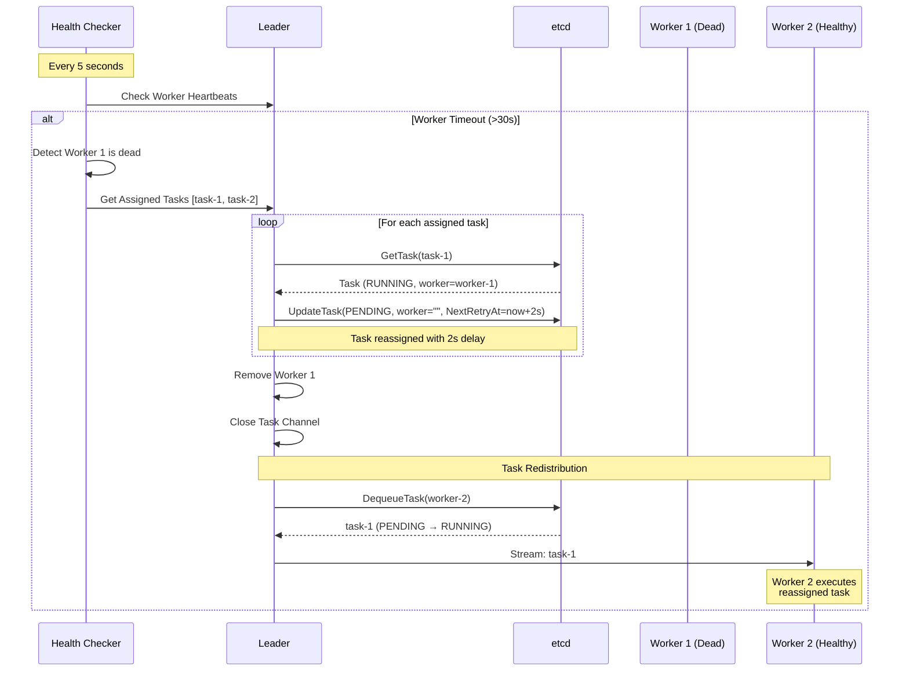
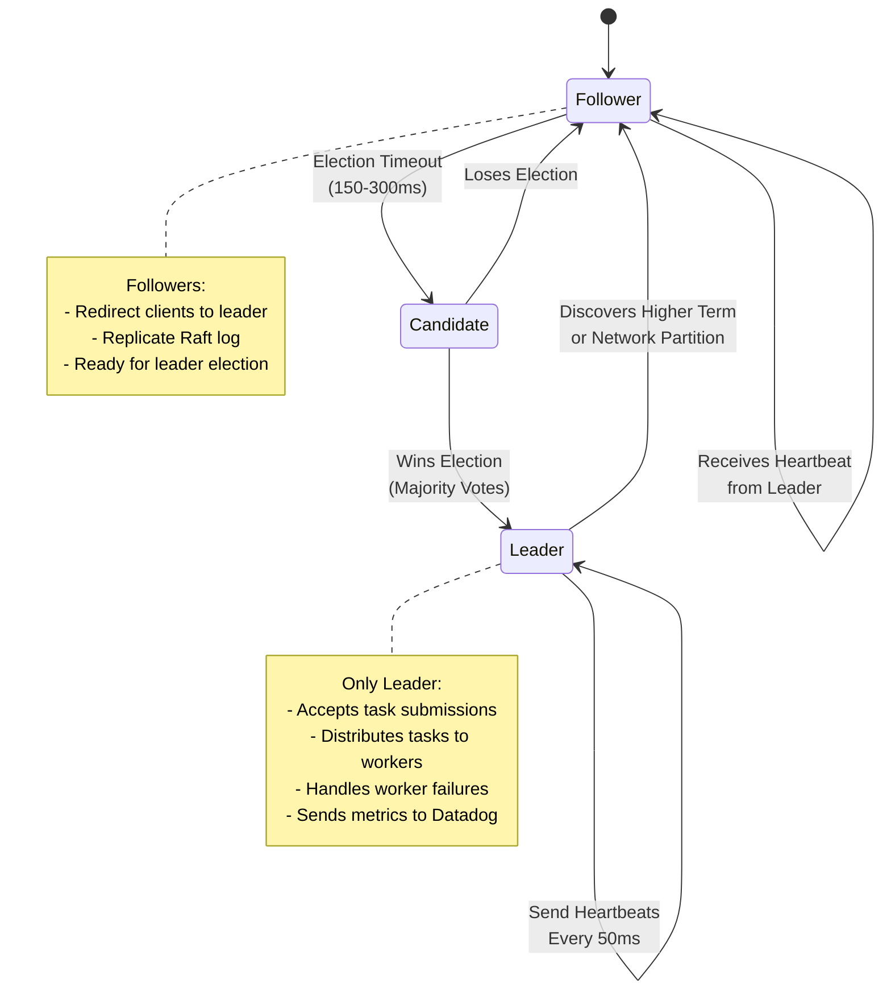
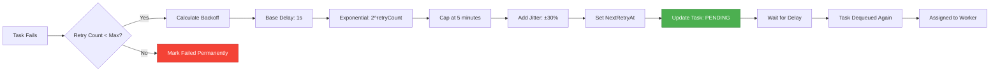
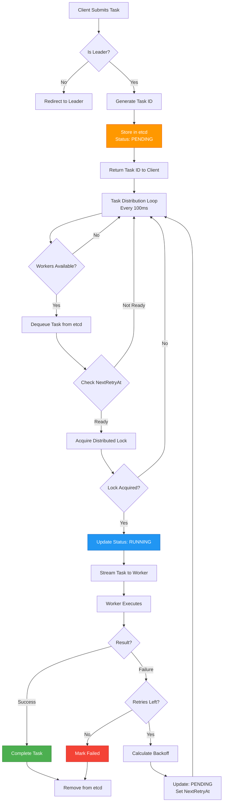

# Architecture

## System Overview

```mermaid
graph TB
    subgraph "Client Layer"
        Client[Client Application]
    end

    subgraph "Scheduler Cluster (Raft Consensus)"
        Leader[Scheduler Leader<br/>Node 1<br/>:8001]
        Follower1[Scheduler Follower<br/>Node 2<br/>:8002]
        Follower2[Scheduler Follower<br/>Node 3<br/>:8003]
        Follower3[Scheduler Follower<br/>Node 4<br/>:8004]
        Follower4[Scheduler Follower<br/>Node 5<br/>:8005]
        
        Leader -.Raft Consensus.-> Follower1
        Leader -.Raft Consensus.-> Follower2
        Leader -.Raft Consensus.-> Follower3
        Leader -.Raft Consensus.-> Follower4
    end

    subgraph "Storage Layer"
        etcd[(etcd<br/>Distributed KV Store<br/>:2379)]
    end

    subgraph "Worker Pool"
        Worker1[Worker 1<br/>Capacity: 10]
        Worker2[Worker 2<br/>Capacity: 10]
        Worker3[Worker 3<br/>Capacity: 10]
        Worker4[Worker 4<br/>Capacity: 10]
        Worker5[Worker 5<br/>Capacity: 10]
    end

    subgraph "Monitoring"
        Datadog[Datadog Agent<br/>:8125 UDP]
        Prometheus[Prometheus Metrics<br/>:9001/metrics]
    end

    Client -->|gRPC: SubmitTask| Leader
    Client -->|Redirected if not leader| Follower1
    
    Leader -->|Store Tasks| etcd
    Follower1 -->|Read Tasks| etcd
    Follower2 -->|Read Tasks| etcd
    Follower3 -->|Read Tasks| etcd
    Follower4 -->|Read Tasks| etcd
    
    Leader -->|gRPC Stream: Distribute Tasks| Worker1
    Leader -->|gRPC Stream: Distribute Tasks| Worker2
    Leader -->|gRPC Stream: Distribute Tasks| Worker3
    Leader -->|gRPC Stream: Distribute Tasks| Worker4
    Leader -->|gRPC Stream: Distribute Tasks| Worker5
    
    Worker1 -.Heartbeat Every 5s.-> Leader
    Worker2 -.Heartbeat Every 5s.-> Leader
    Worker3 -.Heartbeat Every 5s.-> Leader
    Worker4 -.Heartbeat Every 5s.-> Leader
    Worker5 -.Heartbeat Every 5s.-> Leader
    
    Leader -->|StatsD Metrics| Datadog
    Leader -->|HTTP Metrics| Prometheus
    
    style Leader fill:#4CAF50,stroke:#2E7D32,color:#fff
    style etcd fill:#FF9800,stroke:#E65100,color:#fff
    style Datadog fill:#632CA6,stroke:#4A148C,color:#fff
    style Prometheus fill:#E6522C,stroke:#C62828,color:#fff
```

## Task Lifecycle

## Worker Failure Detection & Recovery

## Raft Consensus & Leader Election

## Exponential Backoff Strategy

## Data Flow

## Key Design Decisions

### 1. **Raft Consensus**
- **Why**: Ensures single leader for task distribution, prevents split-brain
- **Configuration**: 5 nodes, sub-2s leader election
- **Trade-off**: Can tolerate 2 node failures (N/2 - 1)

### 2. **etcd for Storage**
- **Why**: Distributed locking, strong consistency, watch capabilities
- **Usage**: Task queue, distributed locks, task state
- **Alternative Considered**: Redis (lacks strong consistency)

### 3. **gRPC Bidirectional Streaming**
- **Why**: Low latency, efficient binary protocol, streaming for real-time updates
- **Performance**: <100ms latency, 10K+ tasks/sec
- **Alternative Considered**: HTTP/REST (higher overhead)

### 4. **Exponential Backoff with Jitter**
- **Why**: Prevents thundering herd, reduces load during failures
- **Formula**: `min(base * 2^retryCount, 5min) * (1 ± 30%)`
- **Impact**: Graceful degradation under load

### 5. **Worker Health Checks**
- **Why**: Detect and recover from worker failures automatically
- **Configuration**: 5s check interval, 30s timeout
- **Recovery**: Automatic task reassignment with 2s delay

## Performance Characteristics

| Metric | Value | Notes |
|--------|-------|-------|
| **Throughput** | 24,748 tasks/sec | Measured with 5 workers |
| **Latency** | <100ms | Task submission to execution |
| **Leader Election** | <2s | Raft consensus time |
| **Worker Timeout** | 30s | Before task reassignment |
| **Health Check** | 5s | Worker liveness check interval |
| **Max Retry Delay** | 5 minutes | Exponential backoff cap |
| **Fault Tolerance** | 2 node failures | With 5-node cluster |

